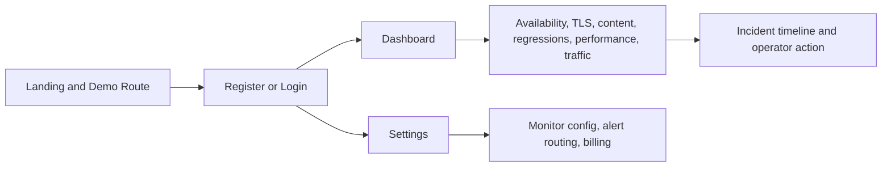

# Status Beacon

Status Beacon is an open-source synthetic monitoring workspace for teams that want readable uptime signal, rendered page checks, TLS identity drift detection, visual regressions, performance budgets, request waterfall visibility, first-party traffic telemetry, and routed alerts in one product.

## Highlights

- Uptime, status code, response time, TTFB, and SSL expiry tracking
- Browser-rendered keyword checks with optional NoScript fallback validation
- TLS certificate details, approved TLS baseline workflow, and incident timeline
- Screenshot baselines, visual regressions, performance budgets, and slow-request waterfall summaries
- Email and Telegram alerts plus per-monitor traffic telemetry ingest
- Public landing/demo flow and authenticated dashboard/settings workspace

## Quick start

1. Copy `.env.example` to `.env`.
2. For local Docker development, keep `FRONTEND_URL=http://localhost` and `CORS_ORIGINS=http://localhost:3000,http://localhost`.
3. Run `docker compose up --build`.
4. Open `http://localhost`.
5. Use [docs/setup.md](docs/setup.md) for the full local setup guide.

For a basic local bring-up, SMTP, Telegram, Stripe, and Turnstile can stay blank.

## Documentation

- [docs/setup.md](docs/setup.md) - minimal local setup and manual development mode
- [CONTRIBUTING.md](CONTRIBUTING.md) - contribution workflow and validation expectations
- [docs/github-demo.md](docs/github-demo.md) - fast GitHub-oriented product walkthrough

## GitHub demo path

If you are landing on this repository from GitHub and want the fastest product tour:

1. Open your deployed instance.
2. From the landing page, use `Demo route` -> `View demo data`.
3. Review [docs/github-demo.md](docs/github-demo.md) for the intended operator workflow.
4. Create an account if you want the full dashboard/settings flow.

What is public versus gated:

- Public: landing page, pricing, and the demo monitoring snapshot
- Authenticated: dashboard, settings, monitor management, alert routing, and billing actions

## Stack

- Backend: FastAPI, SQLAlchemy async, Celery, Redis, PostgreSQL, Playwright
- Frontend: React, Vite, TypeScript, Tailwind CSS
- Runtime: Docker Compose and nginx

## Product flow



## Repository layout

```text
backend/     FastAPI API, worker tasks, monitoring services
frontend/    React dashboard and settings UI
docs/        Setup notes and public product walkthroughs
examples/    Telemetry ingestion examples
nginx/       Local and production nginx configs
ops/         Small operational helper scripts
```

## Contributing

Open issues or feature requests with the GitHub issue templates, and read [CONTRIBUTING.md](CONTRIBUTING.md) before opening a pull request. Keep changes focused, avoid committing secrets, and include the validation commands you ran.