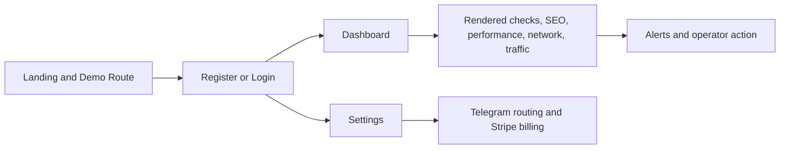

# Status Beacon

Status Beacon is a public full-stack synthetic monitoring workspace for teams that need readable uptime signal, rendered page checks, visual regressions, performance budgets, request waterfall visibility, first-party traffic telemetry, and routed alerts in one product.

Public demo URL: add your own deployed instance here if you want a public showcase.

## GitHub demo

If you are landing on this repository from GitHub and want the fastest product tour, use this path:

- Live product: use your own public deployment URL
- Public no-login surface: open the landing page and use `Demo route` -> `View demo data`
- Detailed walkthrough: [docs/github-demo.md](docs/github-demo.md)

What the GitHub demo shows quickly:

- Landing: product positioning, plan structure, and a public monitoring snapshot
- Dashboard: incident-first operational review surface with rendered, SEO, performance, network, and traffic signal
- Settings: alert routing, Telegram connect flow, and Stripe billing management

What is public versus gated:

- Public: landing page, pricing, and the demo monitoring snapshot
- Authenticated: dashboard, settings, monitor management, alert routing, and billing actions

## What it does

- Tracks uptime, status code, response time, TTFB, and SSL expiry.
- Runs browser-rendered checks against visible page text.
- Supports optional NoScript fallback checks for degraded client-rendered pages.
- Captures screenshot baselines and visual regressions.
- Evaluates per-monitor performance budgets.
- Captures request waterfall summaries and slowest requests.
- Accepts first-party traffic telemetry via per-monitor ingest URLs.
- Sends alerts by email and Telegram.

## Quick evaluation flow

Use this sequence if you want to judge the product quickly from the repository and the live deployment:

1. Open your deployed instance and inspect the landing page structure.
2. In `Demo route`, click `View demo data` to see the public sample monitoring output.
3. Review [docs/github-demo.md](docs/github-demo.md) for the expected operator workflow and where each feature lives.
4. If you want the full app flow, create an account and continue into Dashboard and Settings.

The workflow is split intentionally:

- Settings owns monitor configuration and alert routing.
- Dashboard stays read-first and keeps result categories visible instead of hiding them behind a collapsed details view.

## Stack

- Backend: FastAPI, SQLAlchemy async, Celery, Redis, PostgreSQL, Playwright
- Frontend: React, Vite, TypeScript, Tailwind CSS
- Runtime: Docker Compose, nginx

## Product flow



## Repository layout

```text
backend/     FastAPI API, worker tasks, monitoring services
frontend/    React dashboard and settings UI
nginx/       Local and production nginx configs
```

## Public repo note

This README stays product-focused on purpose.

- It shows what Status Beacon does and how to evaluate the experience quickly.
- It does not document private deployment workflow, infrastructure layout, or detailed operational runbooks.
- The repository contains the implementation, but the public README is not meant to be a build-your-own monitoring platform tutorial.